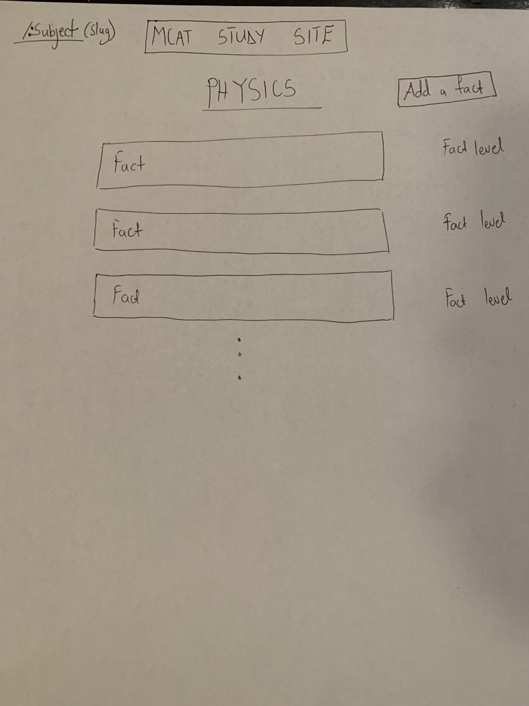
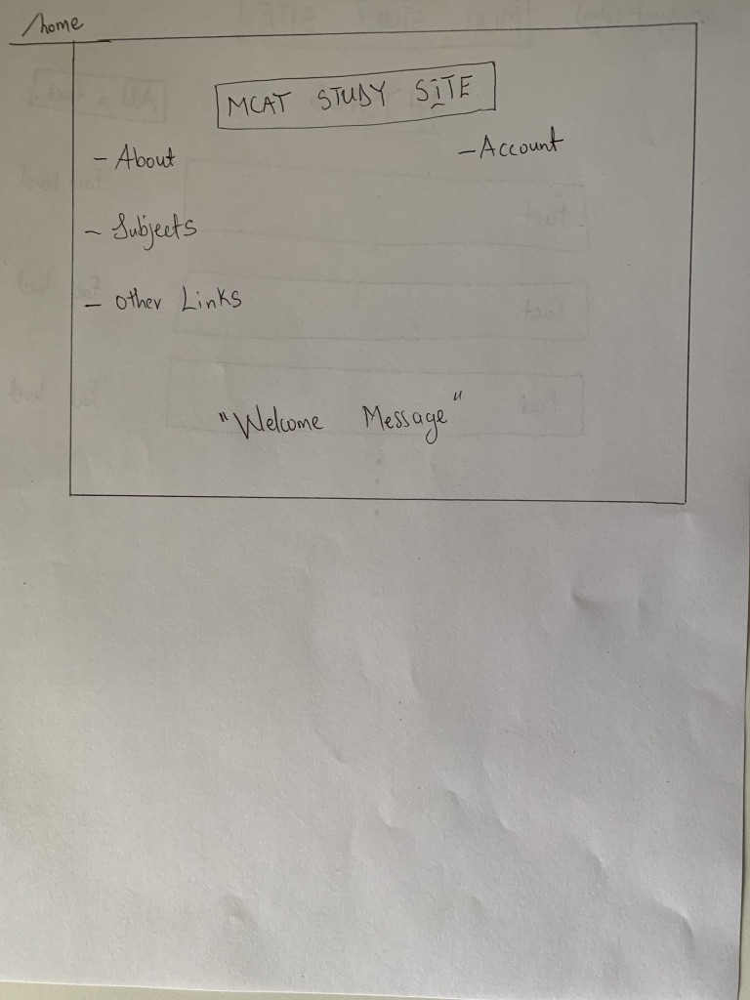
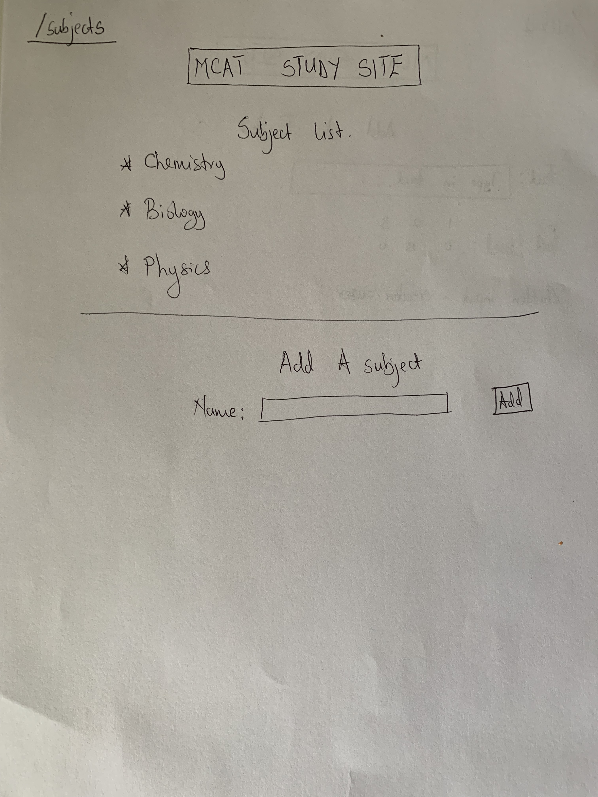
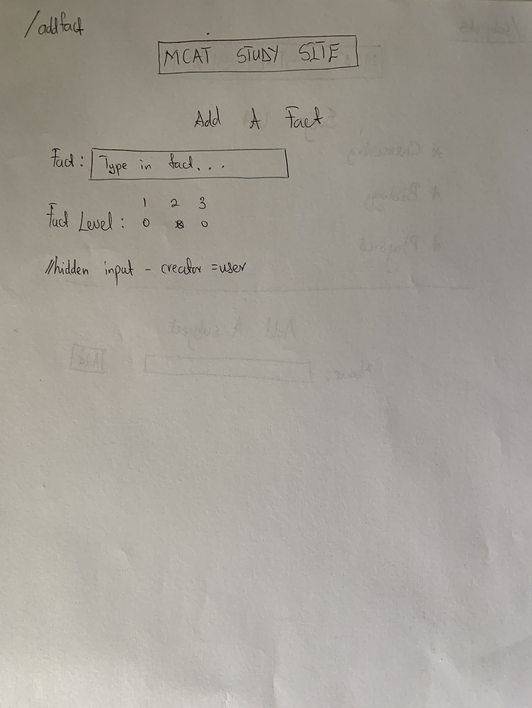

The content below is an example project proposal / requirements document. Replace the text below the lines marked "__TODO__" with details specific to your project. Remove the "TODO" lines.

# MCAT STUDY SITE / QUICK FACTS

## Overview

Life as a premed student is interesting. Other premed students may choose to describe this life as a stressful, torturous, stress inducing, anxiety creating lifestyle that leads to nothing but existential crises and constantly questioning your life choices. That may all be true but I feel "interesting" just has a better ring to it.  

This web app is simply designed to help students attack that formidable test - the MCAT. This app should and will provide all necessary information about the MCAT but its key purpose is to help students study by being a repository of facts, key concepts/statements and anything that one would not want to take this test without having at the front of their minds. You know, the facts that are a MUST to remember but are also very likely to fall through the cracks during the course of one's studying simply due to the amount of stuff that one has to study.


## Data Model

The application will store Subjects, Facts and possibly accounts.

* Subjects will be the various subjects for the exam. Each subject will have an array of facts
* Facts are the infomration that users store on the site. 
* Accounts, if used, will store usernames and passwords and the users subjects and facts.

An Example Subject:

```javascript
{
  name: "Physics",
  
  facts: // an array of Facts
}
```

An Example Fact:

```javascript
{
  info: a string representing the actual fact,
  
  creator: a string that determines who created the fact //this is required some facts will be created by the app for the uesr. As a results this field will take on two values - "user" or "site"
  
  level: Number from 1-3 denoting how important a fact is relative to the others with 3 being a high priority fact
}
```


## [Link to Commented First Draft Schema](https://github.com/nyu-csci-ua-0480-008-spring-2019/owura82-final-project/blob/0ea22cf8fe978f4bc417af2e109a2609852920d9/src/db.js#L1) 

## Wireframes

/subject (:slug) - page page that displays all facts for a subject



/home - homepage: first page that a user encounters upon first visiting the site



/subjects - page showing the current list of subjects and a form to add a new subject



/addfacts - page that allows the user to add in a new fact



## Site map

Here's a [complex example from wikipedia](https://upload.wikimedia.org/wikipedia/commons/2/20/Sitemap_google.jpg), but you can create one without the screenshots, drop shadows, etc. ... just names of pages and where they flow to.

Sitemap for MCAT study site


## User Stories or Use Cases


1. all visitors to the site an view subjects and facts
2. users can add subjects - provided the subject does not exist already
3. users can add facts
4. facts are displayed in order of some kind of rating system - the more users rate a fact the higher it is displayed on the fact list

## Research Topics


* (6 points) jquery
    * jquert is totally knew to me and its because of this unfamiliarity that I give it six points. 
* (2 points) Bootstrap
    * Another unfamiliar framework that I look forward to learning about. 
* Total points - 8


## [Link to Initial Main Project File](https://github.com/nyu-csci-ua-0480-008-spring-2019/owura82-final-project/blob/0ea22cf8fe978f4bc417af2e109a2609852920d9/src/app.js#L1) 


## Annotations / References Used

No references yet
