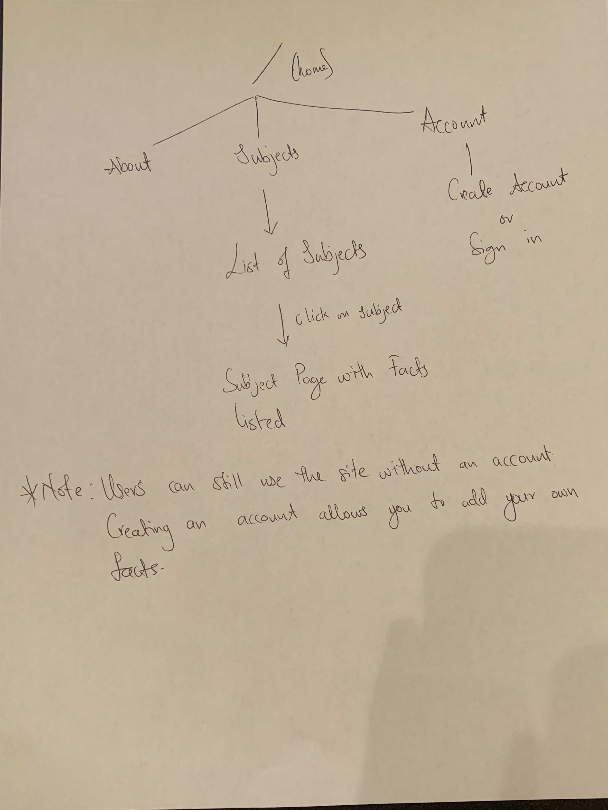

The content below is an example project proposal / requirements document. Replace the text below the lines marked "__TODO__" with details specific to your project. Remove the "TODO" lines.

(___TODO__: your project name_)

# MCAT STUDY SITE / QUICK FACTS

## Overview

(___TODO__: a brief one or two paragraph, high-level description of your project_)

Life as a premed student is interesting. Other premed students may choose to describe this life as a stressful, torturous, stress inducing, anxiety creating lifestyle that leads to nothing but existential crises and constantly questioning your life choices. That may all be true but I feel "interesting" just has a better ring to it.  

This web app is simply designed to help students attack that formidable test - the MCAT. This app should and will provide all necessary information about the MCAT but its key purpose is to help students study by being a repository of facts, key concepts/statements and anything that one would not want to take this test without having at the front of their minds. You know, the facts that are a MUST to remember but are also very likely to fall through the cracks during the course of one's studying simply due to the amount of stuff that one has to study.


## Data Model

(___TODO__: a description of your application's data and their relationships to each other_) 

The application will store Subjects, Facts and possibly accounts.

* Subjects will be the various subjects for the exam. Each subject will have an array of facts
* Facts are the infomration that users store on the site. 

(___TODO__: sample documents_)

An Example Subject:

```javascript
{
  name: "Physics",
  
  facts: // an array of Facts
}
```

An Example Fact:

```javascript
{
  info: a string representing the actual fact,
  
  creator: a string that determines who created the fact //this is required some facts will be created by the app for the uesr. As a results this field will take on two values - "user" or "site"
  
  level: Number from 1-3 denoting how important a fact is relative to the others with 3 being a high priority fact
}
```


## [Link to Commented First Draft Schema](db.js) 

(___TODO__: create a first draft of your Schemas in db.js and link to it_)

## Wireframes

(___TODO__: wireframes for all of the pages on your site; they can be as simple as photos of drawings or you can use a tool like Balsamiq, Omnigraffle, etc._)

/subject (:slug) - page page that displays all facts for a subject


/home - homepage: first page that a user encounters upon first visiting the site


/subjects - page showing the current list of subjects and a form to add a new subject


/addfacts - page that allows the user to add in a new fact


## Site map

(___TODO__: draw out a site map that shows how pages are related to each other_)

Here's a [complex example from wikipedia](https://upload.wikimedia.org/wikipedia/commons/2/20/Sitemap_google.jpg), but you can create one without the screenshots, drop shadows, etc. ... just names of pages and where they flow to.

Sitemap for MCAT study site



## User Stories or Use Cases

(___TODO__: write out how your application will be used through [user stories](http://en.wikipedia.org/wiki/User_story#Format) and / or [use cases](https://www.mongodb.com/download-center?jmp=docs&_ga=1.47552679.1838903181.1489282706#previous)_)

1. as non-registered user, I can register a new account with the site
2. as a user, I can log in to the site
3. as a user, I can create add to the subject list
4. as a user or non registered user, I can view all the subjects
5. as a non registered user, I can only view the facts added by the site. I cannot add my own 
6. as a user, I can view both the facts added by the site and what I added myself.
7. as a user I can add add my own facts. 

## Research Topics

(___TODO__: the research topics that you're planning on working on along with their point values... and the total points of research topics listed_)


* (6 points) vue.js
    * used vue.js as the frontend framework; it's a challenging library to learn, so I've assigned it 5 points
* (2 points) Bootstrap
     *Using bootstrap to make site more responsive 


## [Link to Initial Main Project File](app.js) 

(___TODO__: create a skeleton Express application with a package.json, app.js, views folder, etc. ... and link to your initial app.js_)

## Annotations / References Used

No references yet
